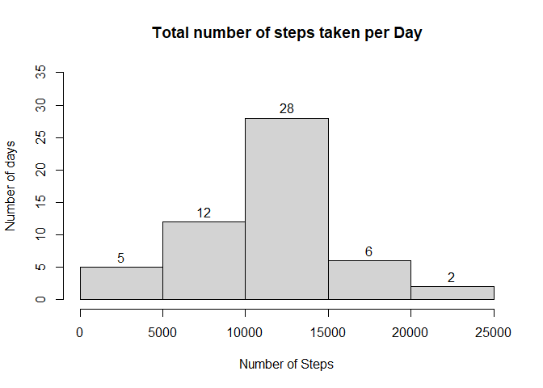
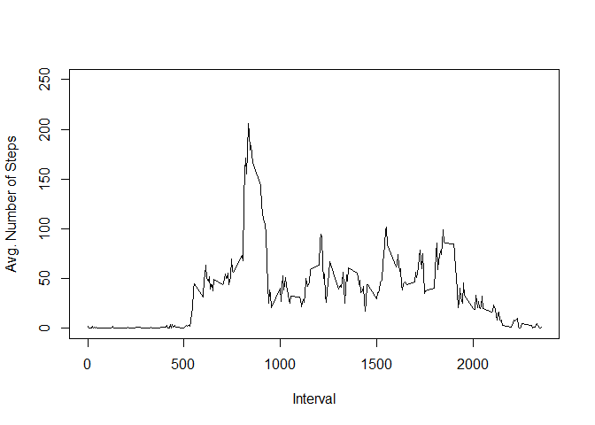
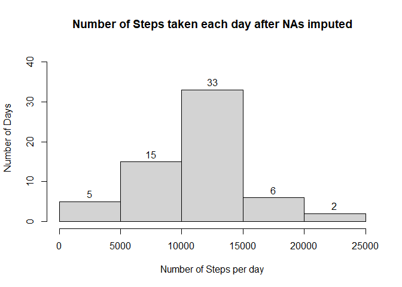
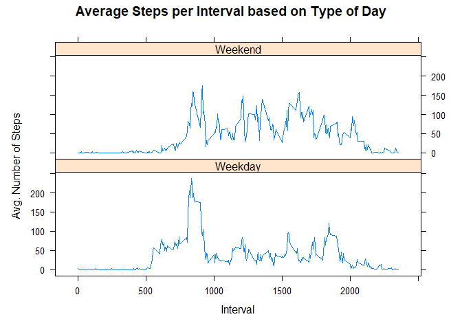

## Loading and preprocessing the data

```r
library(dplyr)
```

```
## 
## Attaching package: 'dplyr'
```

```
## The following objects are masked from 'package:stats':
## 
##     filter, lag
```

```
## The following objects are masked from 'package:base':
## 
##     intersect, setdiff, setequal, union
```

```r
library(ggplot2)
library(plyr)
```

```
## ------------------------------------------------------------------------------
```

```
## You have loaded plyr after dplyr - this is likely to cause problems.
## If you need functions from both plyr and dplyr, please load plyr first, then dplyr:
## library(plyr); library(dplyr)
```

```
## ------------------------------------------------------------------------------
```

```
## 
## Attaching package: 'plyr'
```

```
## The following objects are masked from 'package:dplyr':
## 
##     arrange, count, desc, failwith, id, mutate, rename, summarise,
##     summarize
```

```r
library(lattice)

activity <- read.csv("activity.csv")
activity <- transform(activity, date = as.Date(date))
```


## What is mean total number of steps taken per day?


```r
activity$day <- weekdays(activity$date)
TotSteps_by_day <- aggregate(steps~date, activity, sum)
```

Histogram of the total number of steps taken each day:


```r
hist(TotSteps_by_day$steps, xlab = "Number of Steps", ylab = "Number of days", main = "Total number of steps taken per Day" , labels = TRUE, ylim = c(0,35))
```

<!-- -->

Mean of the total number of steps taken per day:


```r
meanSteps <- as.integer(mean(TotSteps_by_day$steps))
meanSteps
```

```
## [1] 10766
```

Median of the total number of steps taken per day:


```r
medSteps <- as.integer(median(TotSteps_by_day$steps))
medSteps
```

```
## [1] 10765
```


## What is the average daily activity pattern?

```r
avgSteps_perInt <- aggregate(steps~interval, activity, mean)
head(avgSteps_perInt)
```

```
##   interval     steps
## 1        0 1.7169811
## 2        5 0.3396226
## 3       10 0.1320755
## 4       15 0.1509434
## 5       20 0.0754717
## 6       25 2.0943396
```

Time-series Plot:


```r
with(avgSteps_perInt, plot(interval, steps, type= "l", xlab= "Interval", ylab = "Avg. Number of Steps", ylim = c(0,250)))
```

<!-- -->

5-minute interval with the maximum number of steps:


```r
avgSteps_perInt[which.max(avgSteps_perInt[,2]), 1]
```

```
## [1] 835
```


## Imputing missing values

Total number of missing values in the dataset:


```r
naTotal <- sum(is.na(activity))
naTotal
```

```
## [1] 2304
```

Devise a strategy for filling in all of the missing values in the dataset:


```r
avgSteps_dayInt <- ddply(activity, .(interval, day), summarize, Avg= mean(steps, na.rm = TRUE))

naData <- activity[is.na(activity$steps),]
newData <- merge(naData, avgSteps_dayInt, by = c("interval", "day"))

newData2 <- newData[, c(5, 4, 1, 2)]
colnames(newData2) <- c("steps", "date", "interval", "day")

activity1 <- rbind(activity[!is.na(activity$steps),], newData2)
```

Histogram of the total number of steps taken each day:


```r
TotSteps_day1 <- aggregate(steps~date, activity1, sum)
hist(TotSteps_day1$steps, xlab="Number of Steps per day", ylab="Number of Days", main="Number of Steps taken each day after NAs imputed", labels=TRUE, ylim = c(0,42))
```

<!-- -->


Mean of the total number of steps taken per day:


```r
mean_imputed <- as.integer(mean(TotSteps_day1$steps))
mean_imputed
```

```
## [1] 10821
```

Median of the total number of steps taken per day:


```r
median_imputed <- as.integer(median(TotSteps_day1$steps))
median_imputed
```

```
## [1] 11015
```

The new mean of the imputed data is 10821 steps compared to the old mean of 10766 steps. That creates a difference of 55 steps on average per day.

The new median of the imputed data is 11015 steps compared to the old median of 10765 steps. That creates a difference of 250 steps for the median.
However, the overall shape of the distribution has not changed.


## Are there differences in activity patterns between weekdays and weekends?

Create a new factor variable in the dataset with two levels – “weekday” and “weekend”: 


```r
activity2 <- activity1 %>% mutate(dayType = ifelse(weekdays(activity1$date)== "Saturday" | weekdays(activity1$date) == "Sunday", "Weekend", "Weekday"))
```

Panel plot containing a time series plot:


```r
avgSteps_DayTypeIn <- ddply(activity2, .(interval, dayType), summarize, Avg = mean(steps))


with(avgSteps_DayTypeIn, xyplot(Avg~interval|dayType, type="l", layout = c(1,2), main = "Average Steps per Interval based on Type of Day", xla ="Interval", ylab = "Avg. Number of Steps"))
```

<!-- -->

Yes, the step activity trends are different based on whether the day occurs on a weekend or not. This may be due to people having an increased opportunity for activity beyond normal work hours for those who work during the week.
